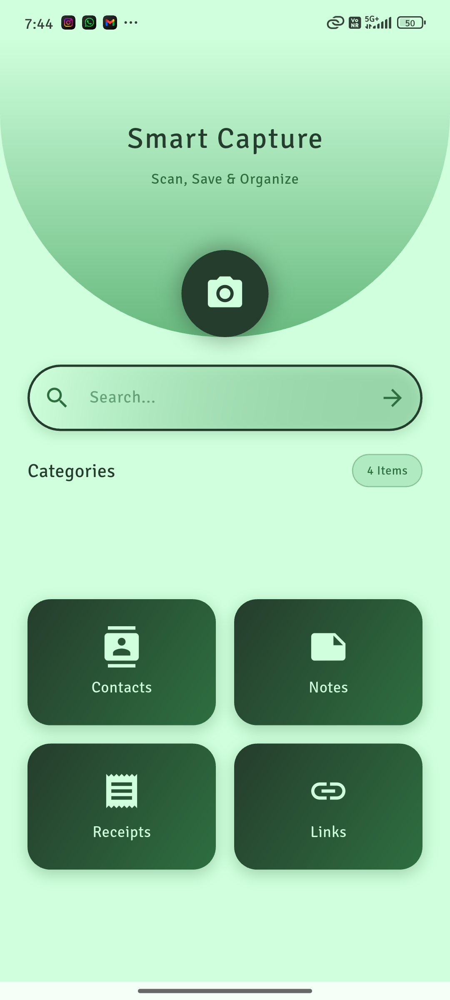
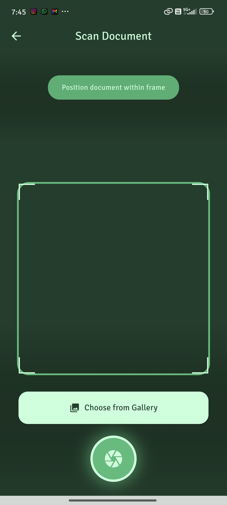
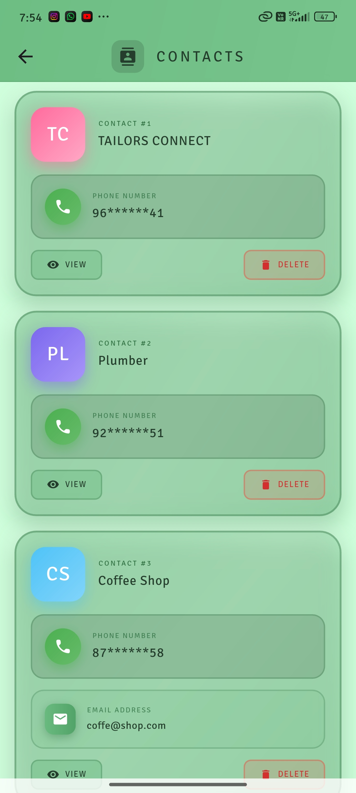
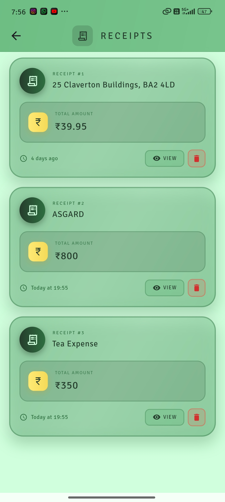
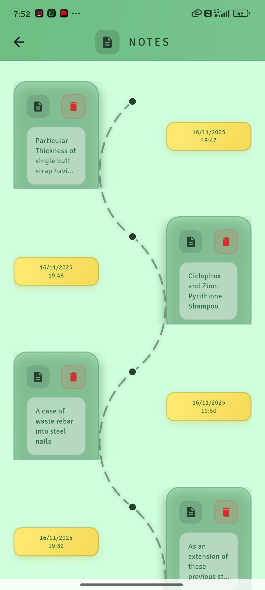
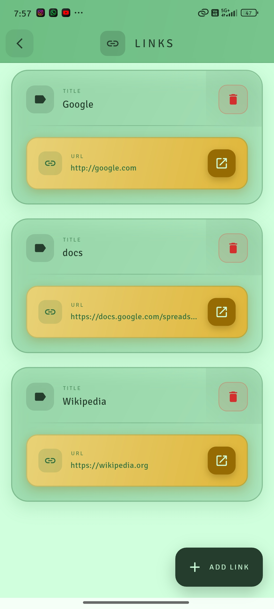

# Sensus

<div align="center">


**Intelligent Document Scanning and Organization**

[](https://flutter.dev)
[](LICENSE)
[](https://github.com)

[Features](#features) • [Installation](#installation) • [Usage](#usage) • [Tech Stack](#tech-stack) • [Contributing](#contributing)

</div>

---

## Features

<div align="center">

### Home Screen

</div>



<div style="display: flex; align-items: center; min-height: 200px;">

The Home Screen serves as your central command center, providing instant access to all captured data and categories. With an intuitive bottom navigation bar and comprehensive statistics display, you can quickly navigate between different sections and monitor your document management activities. The clean, organized interface ensures that everything you need is just one tap away.

▸ **Central Dashboard** - Unified hub for all document management activities  
▸ **Quick Access Navigation** - Seamless switching between contacts, receipts, notes, and links  
▸ **Comprehensive Statistics** - Real-time display of total captured data across all categories  
▸ **Recent Activity Feed** - Quick access to most recently scanned or edited items  
▸ **One-Tap Functionality** - All essential features accessible within a single tap

</div>

<br clear="left"/>

---

<div align="center">

### Scan Screen

</div>



<div style="display: flex; align-items: center; min-height: 200px;">

The Scan Screen is the core of Sensus, where powerful OCR technology meets intuitive design. Whether capturing documents through your camera or importing from gallery, the intelligent frame overlay guides you to perfect scans every time. Real-time processing ensures you get instant text extraction with exceptional accuracy.

▸ **Real-Time Camera Preview** - Live camera feed with optimal scanning interface  
▸ **Document Frame Overlay** - Intelligent guide for perfectly aligned captures  
▸ **Multiple Input Methods** - Direct camera capture and gallery import support  
▸ **Instant OCR Processing** - Immediate text extraction with high accuracy  
▸ **Universal Document Support** - Scans business cards, receipts, notes, and any text document

</div>

<br clear="right"/>

---

<div align="center">

### Contacts

</div>



<div style="display: flex; align-items: center; min-height: 200px;">

The Contacts screen transforms scanned business cards and documents into a beautifully organized digital contact book. With automatic extraction of phone numbers and email addresses, managing your professional network has never been easier. The elegant card-based design with initials avatars makes finding and connecting with contacts effortless.

▸ **Card-Based Layout** - Visually appealing organization of contact information  
▸ **Automatic Extraction** - Smart detection of phone numbers and email addresses  
▸ **One-Tap Calling** - Direct dialing functionality without leaving the app  
▸ **Quick View** - View contacts with intuitive dialogs  
▸ **Powerful Search Function** - Instant contact lookup by name, phone, or email in homescreen

</div>

<br clear="left"/>

---

<div align="center">

### Receipts

</div>



<div style="display: flex; align-items: center; min-height: 200px;">

The Receipts screen provides a comprehensive expense tracking solution with intelligent data extraction from your scanned receipts. Store names, amounts, and complete receipt text are automatically captured and organized chronologically, making expense management and budgeting straightforward. Search through your entire receipt history instantly to find any transaction you need.

▸ **Intelligent Data Extraction** - Automatic store name and amount recognition  
▸ **Multi-Currency Support** - Pattern recognition for various currency formats  
▸ **Full Text Preservation** - Complete receipt text retained for detailed reference  
▸ **Chronological Organization** - Time-stamped entries for easy expense tracking  
▸ **Advanced Search Capability** - Find transactions by store, amount, or date in homescreen

</div>

<br clear="right"/>

---

<div align="center">

### Notes

</div>



<div style="display: flex; align-items: center; min-height: 200px;">

The Notes screen transforms captured text into an organized knowledge base with stunning timeline visualization. Whether you're capturing meeting notes, lecture content, or important reminders, everything is organized chronologically with clear title-content separation. The full-text search capability ensures you can find any note instantly, making it your perfect digital notebook.

▸ **Timeline Visualization** - Beautiful chronological display with date stamps  
▸ **Title-Content Separation** - Clear organization structure for quick scanning  
▸ **Full-Text Search** - Instant note retrieval by searching titles or content in homescreen 
▸ **Multiple Use Cases** - Perfect for meeting notes, lectures, reminders, and thoughts  
▸ **Automatic Saving** - All changes immediately persisted to local storage

</div>

<br clear="left"/>

---

<div align="center">

### Links

</div>



<div style="display: flex; align-items: center; min-height: 200px;">

The Links screen serves as your personal bookmark manager for all URLs captured through document scanning. From QR codes to business cards with websites, every URL is automatically detected, validated, and organized with title-based naming. Direct browser integration means accessing any saved link is just one tap away, keeping all your important web addresses centralized and accessible.

▸ **Addition URL Manually** - Can store web addresses to lookup later  
▸ **URL Validation System** - Ensures only properly formatted links are saved  
▸ **Title-Based Organization** - Intuitive naming system for easy identification  
▸ **Direct Browser Integration** - One-tap opening in default browser  
▸ **Comprehensive Management** - Easy to lookup and navigate

</div>

<br clear="right"/>

---

## About Sensus

Sensus is a powerful multi-purpose document scanning and organization application built with Flutter. Using advanced OCR (Optical Character Recognition) technology, Sensus automatically extracts text from images and intelligently categorizes them into contacts, receipts, notes, and links—streamlining document management workflows.

### Key Capabilities

- **Smart Scanning** - Camera-based document capture with real-time preview
- **Intelligent Recognition** - Automatic document type detection using reges patterns
- **Auto-Organization** - Seamless categorization into structured data types
- **Universal Search** - Cross-category search functionality
- **Offline-First Architecture** - Complete functionality without internet connectivity
- **Modern UI** - Clean, intuitive interface following Material Design principles

---


## Installation

### Prerequisites
- Flutter SDK (3.0 or higher)
- Dart SDK
- Android Studio or Xcode
- Android device/emulator or iOS device/simulator

### Setup Instructions

1. **Clone the repository**
   ```bash
   git clone https://github.com/yourusername/sensus.git
   cd sensus
   ```

2. **Install dependencies**
   ```bash
   flutter pub get
   ```

3. **Run the application**
   ```bash
   flutter run
   ```

### Build for Production

**Android:**
```bash
flutter build apk --release
```

**iOS:**
```bash
flutter build ios --release
```

---

## Usage

1. Launch Sensus and grant necessary permissions (camera, storage)
2. Navigate to the Scan tab and tap the scan button
3. Select input source: Camera or Gallery
4. Wait for OCR processing to complete
5. Review and edit the extracted information in the dialog
6. Save the data - automatic categorization will be applied
7. Access organized data through the bottom navigation tabs
8. Use the search tab to find data across all categories

---

## Tech Stack

### Framework
- **Flutter** - Cross-platform mobile application framework
- **Dart** - Primary programming language

### Core Dependencies
| Package | Purpose |
|---------|---------|
| `google_mlkit_text_recognition` | OCR and text extraction engine |
| `hive_flutter` | Local NoSQL database for offline storage |
| `camera` | Camera hardware access and preview |
| `image_picker` | Gallery and camera image selection |
| `url_launcher` | External URL and phone dialer integration |
| `intl` | Internationalization and date formatting |

### Architecture
- **Storage Layer**: Hive-based local database for offline-first operation
- **State Management**: ValueListenableBuilder with reactive Hive boxes
- **OCR Engine**: Google ML Kit Text Recognition API
- **Text Processing**: Regex-based intelligent parsing for data extraction

---

## Project Structure

```
lib/
├── main.dart                      # Application entry point
├── screens/
│   ├── scan_screen.dart           # Camera scanning interface
│   ├── contacts_screen.dart       # Contact management UI
│   ├── receipts_screen.dart       # Receipt archive interface
│   ├── notes_screen.dart          # Notes collection UI
│   ├── links_screen.dart          # URL bookmarks interface
│   └── search_results_screen.dart # Global search UI
├── services/
│   ├── ocr_service.dart           # OCR processing logic
│   ├── text_parser.dart           # Intelligent text parsing
│   └── storage_service.dart       # Database operations
├── models/
│   ├── contact.dart               # Contact data model
│   ├── receipt.dart               # Receipt data model
│   ├── note.dart                  # Note data model
│   └── link.dart                  # Link data model
└── widgets/
    ├── scan_button.dart           # Reusable button component
    ├── item_card.dart             # Generic card widget
    └── loading_overlay.dart       # Loading state indicator
```

---

## Design System

Sensus implements a cohesive design language with the following principles:

### Color Palette
- **Primary**: #68BA7F (brand green)
- **Secondary**: #2E6F40 (dark green accents)
- **Background**: #CFFFDC (light green background)
- **Text**: #253D2C (dark green text)
- **Accent**: #E8D177 (gold highlights)

### UI Patterns
- Card-based layouts with elevation shadows
- Gradient overlays for visual depth
- Rounded corners (12-24px border radius)
- Circular icon containers
- Status badges for categorization
- Generous padding for readability

---

## Permissions

Sensus requires the following Android/iOS permissions:

- **Camera** - Document scanning functionality
- **Storage** - Gallery access and local data persistence
- **Phone** - Direct calling from saved contacts (optional feature)

---

## Contributing

Contributions are welcome and appreciated. To contribute:

1. Fork the repository
2. Create a feature branch (`git checkout -b feature/YourFeature`)
3. Commit your changes (`git commit -m 'Add YourFeature'`)
4. Push to the branch (`git push origin feature/YourFeature`)
5. Open a Pull Request

### Development Guidelines
- Follow Flutter and Dart style guidelines
- Maintain consistent code formatting using `dart format`
- Write clear, descriptive commit messages
- Add inline documentation for complex logic
- Test functionality on both Android and iOS platforms
- Ensure backward compatibility

---

## License

This project is licensed under the MIT License. See the [LICENSE](LICENSE) file for complete details.

---

## Bug Reports

To report bugs, please open an issue including:
- Device model and OS version
- Steps to reproduce the issue
- Expected vs actual behavior
- Screenshots or logs if applicable

---

## Feature Requests

For feature suggestions, open an issue with:
- Clear description of the proposed feature
- Use case and expected benefits
- Relevant mockups or reference implementations

---

## Contact

**Project Maintainer**: Anurag Mohan

- GitHub: [@Anurag-Mohan](https://github.com/Anurag-Mohan)

---

## Acknowledgments

- Google ML Kit for OCR capabilities
- Flutter team for the cross-platform framework
- Hive team for efficient local storage solution
- All contributors and users of Sensus

---

<div align="center">

**Built with Flutter**

Star this repository if you find it useful

</div>
